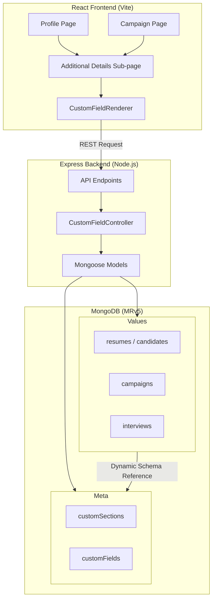

# MapRecruit.ai - TypeScript Implementation

## Overview
This repository contains the TypeScript implementation of the MapRecruit.ai platform, featuring a dynamic custom field system that allows for client-specific metadata integration across Candidate Profiles, Campaigns, and Interviews.

## Project Architecture

## Key Features
- **Dynamic Field Configuration**: Custom sections and fields are loaded from MongoDB metadata.
- **Complex UI Renderers**: Supports various field types including Dependent Dropdowns, List Selections, and File Uploads.
- **Normalized Data Structure**: Custom data is stored in the entity collections (e.g., `resumes`) under the `customData` field for performance and consistency.
- **Responsive Navigation**: Integration of "Additional Details" sub-pages for various platform roles.

## Tech Stack
- **Frontend**: React, Vite, TailwindCSS, TypeScript.
- **Backend**: Node.js, Express, Mongoose.
- **Database**: MongoDB Atlas.
- **Tooling**: GitHub Actions (CI/CD), MCP (Model Context Protocol).
